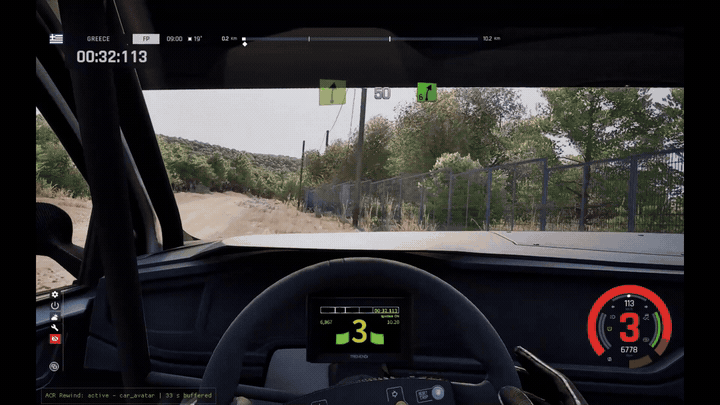

# ACR Rewind (beta)

> **Beta (0.1.0-beta.1).** Rewinding works end to end on the supported game build, but it has
> been tested on only a few cars and stages so far. Please report problems (see
> [Troubleshooting](#troubleshooting)).

A Forza Horizon-style **Rewind** for *Assetto Corsa Rally*. Went off at the last hairpin? Press
Rewind: the game freezes, you scrub the car back along the last 30 seconds of its path, and you
carry on driving from the moment you pick, with the speed it had then.

> **Offline / single-player only.** ACR Rewind detects online sessions and leaderboard modes
> (Time Attack, Challenges, ACR Events) and switches itself off there. If it cannot confirm that
> you are offline, it stays off. Do not try to use it for anything competitive: rewinding
> changes your result, and leaderboard times must stay clean.



## Features

- Freeze, scrub back and forward through the last 30 s, then resume or cancel.
- Analog scrubbing on the triggers or pedals, with an adjustable speed curve.
- Works with keyboard, Xbox and PlayStation pads (XInput), and wheels, button boxes and pedals
  (DirectInput).
- In-game settings panel (`F8`) for bindings and scrub speed, saved to `acr-rewind.toml`.
- Disables itself safely if a game update breaks compatibility, or if the car can't be restored
  correctly.
- Nothing in the game install is modified; uninstalling is deleting four files.

## Requirements

- Windows 10 or 11, 64-bit.
- The **Steam** version of *Assetto Corsa Rally*, **Early Access v0.6 (Steam build 25170642)**.
  See [Compatibility after game updates](#compatibility-after-game-updates).
- No extra runtimes: the C runtime is built in, so no Visual C++ redistributable is needed.
- No other mod that installs its own `dwmapi.dll`, such as UE4SS (see [Install](#install)).

## Install

1. Download `ACR-Rewind-<version>.zip` (e.g. `ACR-Rewind-0.1.0-beta.1.zip`) from the
   [releases page](https://github.com/cherrymcgerry/acr-rewind/releases) and extract it.
   Optionally check it against `SHA256SUMS.txt` from the same release:
   `Get-FileHash .\ACR-Rewind-<version>.zip` in PowerShell.
2. **If you use UE4SS, remove it first.** UE4SS (and some other mods, e.g. certain ReShade setups)
   install a `dwmapi.dll` with the same name; only one can be in the folder.
3. Copy these four files into the game's binary folder, next to `acr.exe`:

   ```
   <ACR>\acr\Binaries\Win64\
   ```

   where `<ACR>` is the game folder, usually
   `...\Steam\steamapps\common\Assetto Corsa Rally` (Steam: right-click the game → Manage →
   Browse local files).

   | File | What it is |
   |---|---|
   | `dwmapi.dll` | Loader. Windows loads it with the game; it forwards everything to the real system `dwmapi.dll` and loads the mod. |
   | `acr_hook.dll` | The mod itself. |
   | `acr-rewind.toml` | Settings and bindings. |
   | `signatures.toml` | Game-specific memory locations for the supported build. |

4. Start the game normally (offline modes such as Free Roam, Practice or Rally School). The mod
   writes `acr-rewind.log` next to the DLLs.

## Uninstall

Delete `dwmapi.dll`, `acr_hook.dll`, `acr-rewind.toml`, `signatures.toml` and `acr-rewind.log`
from `<ACR>\acr\Binaries\Win64\`. Nothing else is changed.

## Controls

Press **Rewind** and the game freezes and shows a timeline with the cursor at the
present. Scrub back and forward, then **Resume** to drive on from the cursor (later history is
discarded), or **Cancel** to return to the present with nothing changed.

| Action | Keyboard | Xbox pad | PlayStation pad |
|---|---|---|---|
| Rewind (enter the mode) | `R` | `View` / `Back` | `Create` / `Share` |
| Scrub back | `Left` | `LT` (analog) | `L2` (analog) |
| Scrub forward | `Right` | `RT` (analog) | `R2` (analog) |
| Resume from the cursor | `Enter` | `A` | `Cross` |
| Cancel (back to the present) | `Backspace` | press Rewind again | press Rewind again |
| Settings panel | `F8` | — | — |

- **Wheels, button boxes and pedals** have no default bindings: open the settings panel (`F8`),
  click *add binding* next to an action, and press the wheel button, hat direction or pedal.
- Holding Rewind after entering the mode also scrubs back, which is handy with a single wheel
  button.
- The further you press a trigger or pedal, the faster it scrubs. Keys and buttons start slow and
  speed up while held.
- **The game still sees the triggers while the car is frozen**, so the scrub triggers are also
  throttle and brake. Nothing happens while frozen, but if you are still on the throttle when you
  resume, the car pulls away at once. Set `resume_requires_release = true` under `[mode]` in
  `acr-rewind.toml` to make Resume wait until the triggers are released.

### Settings panel (F8)

Press `F8` in-game. While it is open, rewind is paused and mouse and keyboard input go to the
panel, not the game.

- **Bindings**: every action and its bindings. *add binding*, then press a key, pad button,
  trigger, wheel button, hat or pedal (`Esc` cancels); *remove* deletes one. Bindings shared
  with another action are flagged.
- **Scrub speed** and **Rewind mode**: sliders and options; changes apply immediately.
- **Devices**: the connected pads and DirectInput devices.
- **Save** writes your changes to `acr-rewind.toml` (comments are kept). **Revert to file**
  discards unsaved changes; **Defaults** restores the shipped settings.

A gamepad can navigate the panel with the d-pad and `A`/`B`. You can also edit
`acr-rewind.toml` by hand; every option is commented.

## Known limitations

- **Beta:** tested so far only with the **VW Polo GTI R5** on a few stages. Other cars are
  expected to work, but haven't been verified yet.
- Engine RPM and gear are not restored directly (the game has no way to set them). A short
  run-in while resuming spins the engine and tyres back up, so the car may need a moment to
  settle.
- Scrubbing can be choppy in dense vegetation, where a crash spawns a lot of debris.
- **UE4SS conflicts:** UE4SS uses the same `dwmapi.dll` file name, so the two can't be installed
  together.
- **Steam Deck / Linux (Proton): untested.** Proton loads its own `dwmapi.dll` unless told
  otherwise; it would need the launch option `WINEDLLOVERRIDES="dwmapi=n,b" %command%`.
- Overlays that hook DirectX, such as RivaTuner Statistics Server (RTSS), may conflict with the
  mod's overlay. If the game crashes or the overlay doesn't appear, try disabling them.
- Rewind is unavailable in replays, online sessions and leaderboard modes, by design.

## Compatibility after game updates

ACR Rewind relies on memory locations that are specific to one game build (`signatures.toml`).
When Assetto Corsa Rally updates, they usually move. The mod notices this at startup, writes the
reason to `acr-rewind.log`, and **disables itself**; the game runs normally without rewind.
Wait for an updated release (usually just a new `signatures.toml`), or remove the mod in the
meantime. There is no need to roll back the game.

## Troubleshooting

Everything the mod does is logged to **`acr-rewind.log`**, next to the DLLs in
`<ACR>\acr\Binaries\Win64\`. New sessions are appended to the end of the file. Look for these
lines:

| Log line | Meaning |
|---|---|
| `game build differs from verified_build` | The game was updated; the mod may not work until it is updated too. |
| `online guard: Blocked(…)` | You are online or in a leaderboard mode (or the mod couldn't confirm you are offline). The reason is listed. |
| `backend: car_avatar …` and `player car found` | Everything resolved; rewind is ready. |
| `post-resume validation failed (1/3 in a row)` | A resume didn't land exactly where expected. Rewind stays enabled. |
| `post-resume validation failed 3 times in a row` | Rewind is disabled until the car respawns or you restart or change the stage. |
| No log file at all | The loader didn't run: check the files are next to `acr.exe`, and that no other `dwmapi.dll` mod replaced it. |

**Reporting a problem:** open an [issue on GitHub](https://github.com/cherrymcgerry/acr-rewind/issues/new/choose)
(bug report template) or post in the Nexus
Mods *Bugs* tab, and include:

- `acr-rewind.log` (attach the file, right after the problem happened);
- the game build (printed at the start of each session in the log) and the mod version;
- your input device (keyboard, pad model, wheel model);
- the car, the stage, and what you did.

### Antivirus warnings

Some antivirus programs flag DLL-proxy loaders like `dwmapi.dll` (a DLL that loads another DLL
into a game) as suspicious. This is a known false positive for this kind of mod. The source code
is public, release zips are built from it by GitHub Actions, and each release lists SHA-256
checksums in `SHA256SUMS.txt` so you can confirm your download is unmodified
(`Get-FileHash <file>` in PowerShell).

## Disclaimer

ACR Rewind is an unofficial fan project. It is **not affiliated with or endorsed by KUNOS
Simulazioni, Supernova Games Studios, 505 Games, Valve, or Nexus Mods**. "Assetto Corsa" and
"Assetto Corsa Rally" are trademarks of their respective owners. The mod works by reading and
writing the game's memory while it runs; use it **offline only and at your own risk**. It is
provided "as is", without warranty of any kind (see the licenses).

## License

Dual-licensed under either of [MIT](LICENSE-MIT) or [Apache-2.0](LICENSE-APACHE), at your
option. Third-party components and their licenses are listed in
[THIRD_PARTY_NOTICES.md](THIRD_PARTY_NOTICES.md).

## For developers

ACR Rewind is written in Rust. The game is Unreal Engine 5.6, but its car physics is a custom
Kunos-derived solver; the mod restores the car through the game's own `CarAvatar` functions and
the solver's rigid bodies, driven from a ProcessEvent detour on the game thread.

```powershell
$env:Path += ";$HOME\.cargo\bin"
cargo build --workspace --release
cargo test --workspace
powershell -ExecutionPolicy Bypass -File scripts\package.ps1   # dist\ACR-Rewind-<version>.zip
```

| Crate | Purpose |
|---|---|
| `rewind_core` | Engine-independent rewind logic: snapshots, ring buffer, scrub controller, settings. |
| `acr_shm` | Reader for the game's `acpmf_*` shared-memory telemetry. |
| `acr_ue` | Game adapter: signature scanning, UE reflection, car backends, sim rigid-body locator. |
| `acr_hook` | The injected DLL: tick hook, rewind driver, input, online guard, overlay. |
| `acr_loader` | The `dwmapi.dll` proxy loader, plus `injector.exe` for development. |
| `acr_probe` | `acr-probe`, a read-only external inspection tool for reverse engineering. |

Documentation:

- [CONTRIBUTING.md](CONTRIBUTING.md): building, tests, and the offline-only policy.
- [docs/updating-after-a-patch.md](docs/updating-after-a-patch.md): refreshing
  `signatures.toml` for a new game build with `acr-probe` and Dumper-7.
- [docs/re-notes.md](docs/re-notes.md): technical reference (engine globals, sim rigid bodies,
  `car_avatar` backend, online guard, log lines).
- [docs/beta-test-checklist.md](docs/beta-test-checklist.md): what beta testers should try.
- [CHANGELOG.md](CHANGELOG.md).

**Validation mode.** Set `read_only = true` under `[hook]` in `acr-rewind.toml` to record and
log snapshots against shared memory without ever writing to the game or freezing it. Use it to
check `signatures.toml` on a new build before enabling writes (`docs/re-notes.md` §9.5 lists the
log lines to check).


